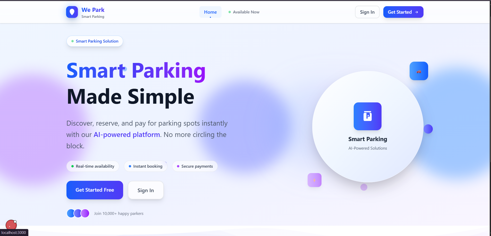

# 🚗 We Park - Smart Parking Solution

A modern, beautiful web application for finding and booking parking spots with real-time availability and seamless user experience.



## ✨ Features

### 🎯 **Core Functionality**

- **Real-time Parking Search** - Find available spots instantly
- **Interactive Map View** - Visual parking spot locations
- **Smart Booking System** - Reserve spots with flexible duration
- **User Dashboard** - Comprehensive parking management
- **Beautiful UI/UX** - Modern, responsive design

### 🔐 **Authentication**

- **Google OAuth Integration** - Secure, seamless sign-in
- **Session Management** - Persistent user sessions
- **Protected Routes** - Secure user areas

### 🎨 **Design System**

- **Glass-morphism Effects** - Modern backdrop blur styling
- **Gradient Animations** - Smooth color transitions
- **Responsive Design** - Mobile-first approach
- **Dark/Light Themes** - Coming soon

### 📱 **User Experience**

- **Progressive Enhancement** - Works without JavaScript
- **Loading States** - Smooth interaction feedback
- **Error Handling** - Graceful error management
- **Accessibility** - WCAG compliant

## 🚀 Quick Start

### Prerequisites

- Node.js 18+
- npm or yarn
- Git

### Installation

```bash
# Clone the repository
git clone <your-repo-url>
cd we-park-app

# Install dependencies
npm install

# Set up environment variables
cp .env.local.example .env.local
# Edit .env.local with your values

# Run development server
npm run dev

# Open http://localhost:3000
```

### Environment Variables

```env
# NextAuth.js Configuration
NEXTAUTH_URL=http://localhost:3000
NEXTAUTH_SECRET=your-secret-key

# Google OAuth (Required for authentication)
GOOGLE_CLIENT_ID=your-google-client-id
GOOGLE_CLIENT_SECRET=your-google-client-secret

# Database (Optional for development)
DATABASE_URL=your-database-url
```

## 🛠️ Tech Stack

### **Frontend**

- **Next.js 15** - React framework with App Router
- **React 19** - UI library
- **TypeScript** - Type safety
- **Tailwind CSS** - Utility-first styling

### **Authentication**

- **NextAuth.js** - Authentication library
- **Google OAuth** - Social login
- **JWT Sessions** - Stateless authentication

### **Database** (Optional)

- **Prisma** - Database ORM
- **PostgreSQL/SQLite** - Database options

### **Development**

- **ESLint** - Code linting
- **Prettier** - Code formatting
- **Turbopack** - Fast bundling

## 📁 Project Structure

```
we-park-app/
├── src/
│   ├── app/                    # Next.js App Router
│   │   ├── dashboard/          # User dashboard
│   │   ├── find-parking/       # Parking search
│   │   ├── login/              # Authentication
│   │   └── register/           # User registration
│   ├── components/             # Reusable components
│   ├── presentation/           # UI components
│   │   ├── components/         # Shared UI
│   │   └── layouts/            # Layout components
│   └── lib/                    # Utilities
├── prisma/                     # Database schema
├── public/                     # Static assets
└── auth.ts                     # Authentication config
```

## 🎨 Design Features

### **Color Palette**

- Primary: Blue (#3B82F6) to Indigo (#6366F1)
- Secondary: Emerald (#10B981) to Teal (#14B8A6)
- Accent: Purple (#8B5CF6) to Pink (#EC4899)

### **Typography**

- Headings: Inter/System fonts
- Body: Optimized for readability
- Gradients: Text gradients for emphasis

### **Animations**

- Micro-interactions on hover/focus
- Loading states with skeleton screens
- Smooth page transitions

## 🗺️ App Flow

1. **Landing Page** - Hero section with features
2. **Authentication** - Google OAuth sign-in
3. **Dashboard** - User stats and quick actions
4. **Find Parking** - Interactive map and search
5. **Booking** - Spot selection and payment
6. **History** - Past bookings and receipts

## 🔧 Development

### **Available Scripts**

```bash
# Development
npm run dev          # Start dev server
npm run build        # Build for production
npm run start        # Start production server
npm run lint         # Run ESLint

# Database (when using Prisma)
npx prisma generate  # Generate Prisma client
npx prisma db push   # Push schema to database
npx prisma studio    # Open database browser
```

### **Code Quality**

- TypeScript strict mode enabled
- ESLint with Next.js recommended rules
- Consistent code formatting
- Component-based architecture

## 🚀 Deployment

### **Vercel (Recommended)**

```bash
# Install Vercel CLI
npm i -g vercel

# Deploy
vercel --prod
```

### **Environment Variables**

Set the following in your deployment platform:

- `NEXTAUTH_URL` - Your domain URL
- `NEXTAUTH_SECRET` - Random secret string
- `GOOGLE_CLIENT_ID` - Google OAuth client ID
- `GOOGLE_CLIENT_SECRET` - Google OAuth secret

## 🔄 Version History

- **v1.0.0** - Initial release with core features
- **v0.9.0** - Authentication and dashboard
- **v0.8.0** - Find parking functionality
- **v0.7.0** - Beautiful UI components

## 🤝 Contributing

1. Fork the repository
2. Create a feature branch (`git checkout -b feature/amazing-feature`)
3. Commit your changes (`git commit -m 'Add amazing feature'`)
4. Push to the branch (`git push origin feature/amazing-feature`)
5. Open a Pull Request

## 📝 License

This project is licensed under the MIT License - see the [LICENSE](LICENSE) file for details.

## 🙏 Acknowledgments

- [Next.js](https://nextjs.org/) - React framework
- [Tailwind CSS](https://tailwindcss.com/) - Styling
- [NextAuth.js](https://next-auth.js.org/) - Authentication
- [Vercel](https://vercel.com/) - Deployment platform

## 📞 Support

- **Documentation**: See setup instructions above
- **Issues**: Open a GitHub issue
- **Email**: support@wepark.com (placeholder)

---

Built with ❤️ for modern parking solutions

# We-park-App
